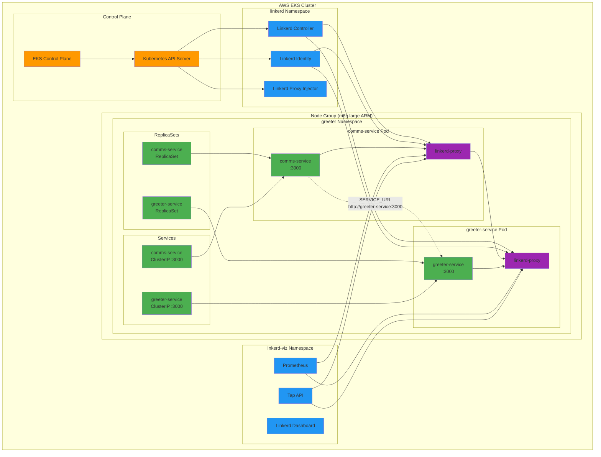

# Kubernetes + Linkerd Project

A project for deploying and managing a Kubernetes cluster with Linkerd service mesh integration.

## Overview

This repository contains the configuration and scripts needed to:
- Create an EKS cluster using eksctl
- Install and configure Linkerd service mesh
- Deploy sample applications with service mesh capabilities

## Prerequisites

- AWS CLI configured with appropriate credentials
- `eksctl` installed ([installation guide](https://eksctl.io/introduction/#installation))
- `kubectl` installed
- Docker installed (for building/pushing images)

## Quick Start

### 1. Create the Kubernetes Cluster

First, create the EKS cluster using the provided configuration:

```bash
eksctl create cluster -f kubernetes/cluster/cluster-config.yaml
```

This will create:
- A cluster named "sandbox" in us-west-2 region
- A managed node group with 2 ARM-based m6g.large instances

### 2. Verify Cluster Access

Confirm your cluster is accessible:

```bash
kubectl get nodes
kubectl get pods --all-namespaces
```

### 3. Install Linkerd

Run the automated Linkerd installation script:

```bash
./scripts/install-linkerd.sh
```

This script will:
1. Download and install the Linkerd CLI
2. Perform pre-installation compatibility checks
3. Install Linkerd CRDs (Custom Resource Definitions)
4. Install the Linkerd control plane
5. Verify the installation
6. Optionally install the Linkerd dashboard

### 4. Deploy Sample Services

Deploy the sample microservices (greeter namespace with comms-service and greeter-service):

```bash
./scripts/deploy-resources.sh
```

This script will:
1. Create the `greeter` namespace with Linkerd injection enabled
2. Deploy the comms-service (Rust service that calls the greeter)
3. Deploy the greeter-service (Rust service that responds with greetings)
4. Wait for all pods to be ready
5. Verify Linkerd proxy injection

### 5. Verify Installation

Check that Linkerd is running correctly:

```bash
linkerd check
linkerd viz check
```

Check your services are running:

```bash
kubectl get pods -n greeter
kubectl get services -n greeter
```

Access the Linkerd dashboard to see live traffic:

```bash
linkerd viz dashboard
```

## Configuration

### Cluster Configuration

The cluster configuration is defined in `kubernetes/cluster/cluster-config.yaml`:

- **Cluster Name**: sandbox
- **Region**: us-west-2
- **Node Group**: ARM-based instances (m6g.large)
- **Desired Capacity**: 2 nodes

### Linkerd Configuration

The installation script supports the following environment variables:

- `LINKERD_VERSION`: Linkerd version to install (default: stable-2.14.10)
- `INSTALL_DIR`: Installation directory for CLI (default: /usr/local/bin)
- `INSTALL_DASHBOARD`: Install dashboard (default: true)

Example with custom settings:

```bash
LINKERD_VERSION=stable-2.15.0 INSTALL_DASHBOARD=false ./scripts/install-linkerd.sh
```

## Architecture Overview



### How Linkerd Works in This Setup

**Service Mesh Architecture:**
- **Linkerd Control Plane**: Manages the service mesh, handles mTLS certificates, and provides policy enforcement
- **Linkerd Proxy (Sidecar)**: Each pod gets a `linkerd-proxy` container that intercepts all network traffic
- **Automatic Injection**: The `greeter` namespace has `linkerd.io/inject: enabled`, so all pods get proxies automatically
- **Zero-Config mTLS**: All service-to-service communication is automatically encrypted
- **Observability**: JSON access logs capture all HTTP requests between services

**Traffic Flow:**
1. `comms-service` makes HTTP requests to `SERVICE_URL` (greeter-service)
2. Request goes through comms-service's linkerd-proxy
3. Proxy encrypts traffic with mTLS and sends to greeter-service's proxy
4. Greeter-service proxy decrypts and forwards to greeter-service
5. Response follows the same path in reverse
6. All traffic is logged, metered, and visible in the dashboard

## Working with Linkerd

### Inject Linkerd Proxy into Applications

To add Linkerd's data plane proxy to your applications:

```bash
# For a specific deployment
kubectl get deploy <deployment-name> -o yaml | linkerd inject - | kubectl apply -f -

# For all deployments in a namespace
kubectl get deploy -n <namespace> -o yaml | linkerd inject - | kubectl apply -f -
```

### Monitor Traffic

View live traffic between your deployed services:

```bash
# Check traffic statistics for greeter namespace
linkerd viz stat deployments -n greeter

# View real-time traffic between comms and greeter services
linkerd viz tap deployment/comms-service -n greeter

# View service topology and success rates
linkerd viz routes deployment/comms-service -n greeter

# Check overall service health
linkerd viz stat pods -n greeter
```

### View Access Logs

The services are configured with JSON access logs. View them with:

```bash
# View comms-service access logs
kubectl logs -n greeter -l app=comms-service -c linkerd-proxy

# View greeter-service access logs  
kubectl logs -n greeter -l app=greeter-service -c linkerd-proxy

# Follow logs in real-time
kubectl logs -n greeter -l app=comms-service -c linkerd-proxy -f
```

### Security Policies

Generate authorization policies:

```bash
# View current traffic policies
linkerd viz authz -n <namespace>

# Generate policies based on observed traffic
linkerd viz authz -n <namespace> --output-format=yaml
```

## Useful Commands

### Cluster Management

```bash
# Update kubeconfig
eksctl utils write-kubeconfig --cluster=sandbox --region=us-west-2

# Scale node group
eksctl scale nodegroup --cluster=sandbox --region=us-west-2 --name=mng-arm --nodes=3

# Delete cluster
eksctl delete cluster -f kubernetes/cluster/cluster-config.yaml
```

### Linkerd Operations

```bash
# Check Linkerd status
linkerd check

# View control plane status
kubectl get pods -n linkerd

# View dashboard pods
kubectl get pods -n linkerd-viz

# Upgrade Linkerd
linkerd upgrade | kubectl apply -f -
```

## Troubleshooting

### Common Issues

1. **Pre-installation checks fail**: Ensure your cluster meets Linkerd's requirements
2. **Dashboard not accessible**: Check if port-forwarding is working and firewall settings
3. **Proxy injection fails**: Verify the namespace has proper annotations

### Getting Help

- Check Linkerd status: `linkerd check`
- View logs: `kubectl logs -n linkerd -l app=linkerd-destination`
- Linkerd documentation: https://linkerd.io/2/getting-started/

## Clean Up

### Complete Cleanup (Recommended)

Use the automated cleanup script to remove all resources:

```bash
./scripts/cleanup-all.sh
```

This script will:
1. **Delete application resources** - Remove greeter namespace, services, and pods
2. **Uninstall Linkerd** - Remove control plane, dashboard, and all mesh components
3. **Delete EKS cluster** - Remove the entire cluster and AWS resources
4. **Provide cleanup summary** - Show what was deleted and next steps

⚠️ **Warning**: This will delete the entire EKS cluster and all associated AWS resources!

### Manual Cleanup (Alternative)

If you prefer to clean up manually:

```bash
# Remove application resources
kubectl delete -f kubernetes/resources/

# Remove Linkerd dashboard and control plane
linkerd viz uninstall | kubectl delete -f -
linkerd uninstall | kubectl delete -f -

# Delete the EKS cluster
eksctl delete cluster -f kubernetes/cluster/cluster-config.yaml
```

### Partial Cleanup

To remove only the application services (keeping Linkerd and cluster):

```bash
# Delete only the greeter namespace and services
kubectl delete -f kubernetes/resources/
```

### Local Cleanup

After cluster deletion, optionally clean up local files:

```bash
# Remove kubeconfig entries
kubectl config delete-context <context-name>

# Remove Linkerd CLI
sudo rm -f /usr/local/bin/linkerd

# Clean AWS credentials cache
rm -rf ~/.aws/cli/cache
```

## Contributing

1. Fork the repository
2. Create a feature branch
3. Make your changes
4. Test with the provided cluster configuration
5. Submit a pull request

## License

This project is licensed under the BSD 2-Clause License - see the [LICENSE](LICENSE) file for details.