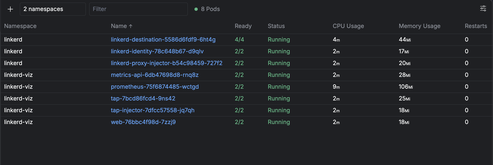
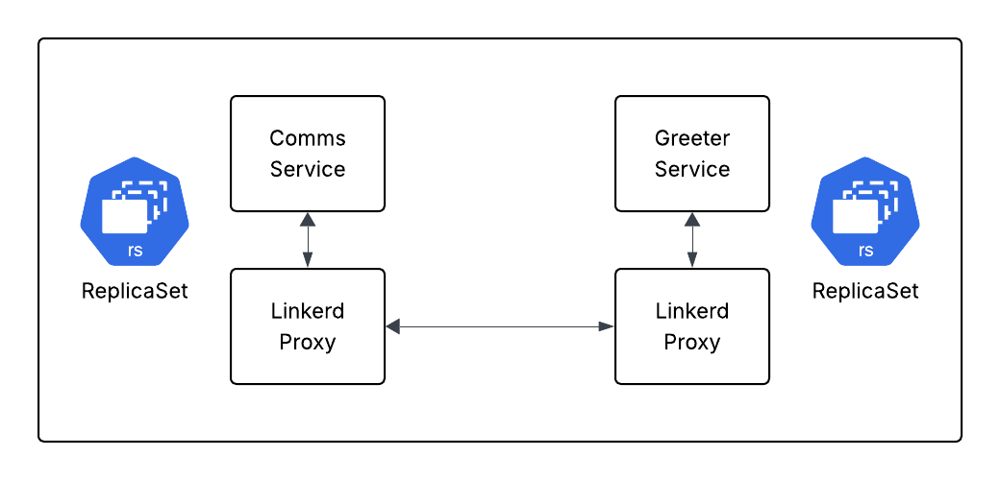

I've been writing for a while now on setting up Kubernetes specifically with AWS' EKS.  I love how EKS gives me the flexibility to install the standard and custom Kubernetes resources that I need and want for my projects.  In this article, I want to explore setting up Linkerd, a service mesh for Kubernetes, on EKS.  Linkerd is a popular service mesh that provides a set of features such as service discovery, load balancing, and traffic management. By using Linkerd, we can easily manage and monitor our Kubernetes applications and ensure that they are running smoothly.  I did some light comparisons a while back between Istio and Linkerd in this [article](https://binaryheap.com/evaluating-2-popular-service-meshes/).  But let's dive in a little bit deeper and setup Linkerd on EKS!

## Setting up Linkerd on EKS

Before I dig into the article, everything that's in here is stored in [this GitHub repository](https://github.com/binaryheap/k8s-linkerd).  Feel free to clone it and follow along!

### Configuring the EKS Cluster

I love running EKS.  It takes care of all the heavy lifting for me, allowing me to focus on building and deploying my applications.  My preferred way of configuring the EKS cluster is to use the [AWS CLI](https://aws.amazon.com/cli/) and the [eksctl](https://eksctl.io/) tool.  I will supply a configuration file to the `eksctl create cluster` command so that I can manage the settings of the cluster in file, but update via the CLI.

The below YAML file will create a cluster called `sandbox` in the `us-west-2` region with a managed Node Group that runs `Amazon Linux 2` on Graviton and has `6` vCPUs and `16` GB of memory.

```yaml
---
apiVersion: eksctl.io/v1alpha5
kind: ClusterConfig

metadata:
  name: sandbox
  region: us-west-2

managedNodeGroups:
  - name: mng-arm
    instanceType: m6g.large
    desiredCapacity: 2
```

I can then run this command to create the cluster:

```bash
eksctl create cluster -f cluster.yaml
```

### Deploying Linkerd

I love deploying applications in Kubernetes either software I've produced or community applications such as Linkerd.  For convenience, I've created a shell script for deploying Linkerd.  The script includes:

* Installing the Linkerd tooling
* Deploying the Kubernetes CRDs
* Installing the Linkerd control plane
* Installing the Linkerd visualization dashboard

Launching the script looks like this:

```bash
./deploy-linkerd.sh
```

Once the script is complete, I can verify that Linkerd is running, including the Viz Dashboard:



## Deploying Applications

For my example services, I've built 2 APIs that are running as Kubernetes ReplicaSets.  They are called the Comms Service and the Greeter Service.  To get this working, I'm opting to just forward the port of the Comms Service instead of setting up a full ingress with public availability.  I wanted to be able to just get testing with Linkerd vs building out something a little more complex.

Adding the Linkerd proxy to my services is a simple as adding an annotation on the Service itself.

```yaml
apiVersion: v1
kind: Service
metadata:
  name: comms-service
  annotations:
  # Adding in Linkerd
    linkerd.io/inject: enabled
spec:
  selector:
    app: comms-service
  ports:
    - protocol: TCP
      port: 3000
      targetPort: 3000
```

As a visual reference, here's a diagram showing how the services relate and bring Linkerd into the mix.



With everything in place, I can now set up the port forward and then execute a cURL command to run the Comms Service API.

```bash
kubectl port-forward comms-service 3000:3000 -n greeter

> curl -v http://localhost:3000/say-hello\?name\=Benjamen | json_pp
* Host localhost:3000 was resolved.
* IPv6: ::1
* IPv4: 127.0.0.1
  % Total    % Received % Xferd  Average Speed   Time    Time     Time  Current
                                 Dload  Upload   Total   Spent    Left  Speed
  0     0    0     0    0     0      0      0 --:--:-- --:--:-- --:--:--     0*   Trying [::1]:3000...
* Connected to localhost (::1) port 3000
> GET /say-hello?name=Benjamen HTTP/1.1
> Host: localhost:3000
> User-Agent: curl/8.7.1
> Accept: */*
>
* Request completely sent off
  0     0    0     0    0     0      0      0 --:--:-- --:--:-- --:--:--     0< HTTP/1.1 200 OK
< content-type: application/json
< vary: origin, access-control-request-method, access-control-request-headers
< access-control-allow-origin: *
< access-control-expose-headers: *
< content-length: 29
< date: Sun, 31 Aug 2025 14:11:15 GMT
<
{ [29 bytes data]
100    29  100    29    0     0    110      0 --:--:-- --:--:-- --:--:--   110
* Connection #0 to host localhost left intact
{
   "message" : "Hello, Benjamen"
}
```

I have the Access Logs for Linkerd turned on and emitting them in JSON format.  I'm then able to run `kubectl` to fetch logs on the Greeter Service to see what I'm getting.

```bash
kubectl logs -n greeter -l app=greeter-service -c linkerd-proxy --tail=1 | jq .
{
  "client.addr": "192.168.36.87:36930",
  "client.id": "default.greeter.serviceaccount.identity.linkerd.cluster.local",
  "host": "greeter-service.greeter.svc.cluster.local:3000",
  "method": "GET",
  "processing_ns": "270323",
  "request_bytes": "",
  "response_bytes": "29",
  "status": 200,
  "timestamp": "2025-08-31T14:10:58.256786757Z",
  "total_ns": "1534820",
  "trace_id": "",
  "uri": "http://greeter-service.greeter.svc.cluster.local:3000/hello?name=Benjamen",
  "user_agent": "",
  "version": "HTTP/2.0"
}
```

All of that looks amazing!

## Next Steps

I've barely scratched the surface of what I can accomplish with [Linkerd](https://linkerd.io/2.18/getting-started/).  The following capabilities are what I'd recommend exploring next (and I just might in future posts):

- [Linkerd's Retries](https://linkerd.io/2.18/reference/retries/)
- [Linkerd's Circuit Breaking](https://linkerd.io/2.18/reference/circuit-breaking/)
- [Linkerd's Telemetry](https://linkerd.io/2.18/features/telemetry/)

These 3 topics would be a great next step for adding robustness to a Kubernetes managed application.  What I love about using a Service Mesh is that I don't have to hand code or pick libraries to handle additional features.  I get this at the infrastructure level so developers (like myself) can focus on building great applications.

## Wrapping Up

Linkerd is a powerful Service Mesh that comes in a very simple and non-complex package.  Some of the knocks on Meshes are that they have this inherent level of complexity to configure and just get running.  I hope you've seen from this more bite-sized article that setting up Linkerd is extremely straightforward and can have minimal configuration.  Sure, things will get more in-depth as you add more features, but that's how I'd like it to be.  Easy to setup.  Advanced when I need it.

In future articles, I hope to explore some of the more advanced features and how I can add additional capabilities to my Kubernetes applications without having to write any more code.

Thanks for reading and Happy Building!
